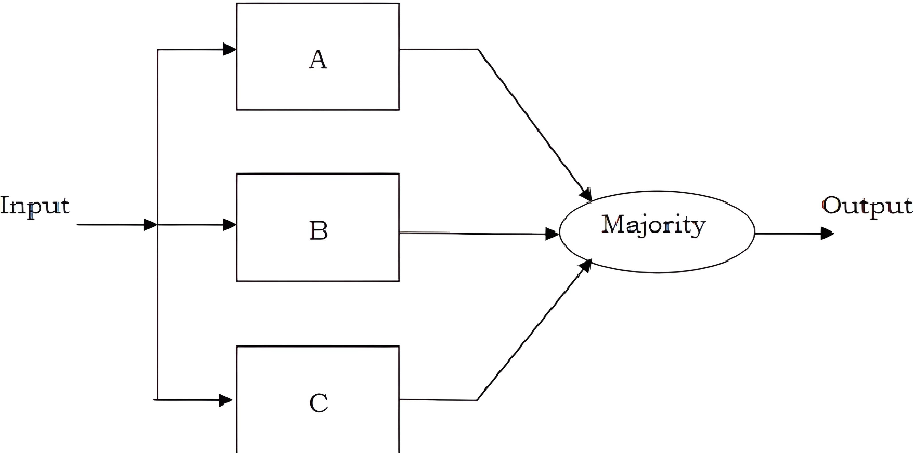
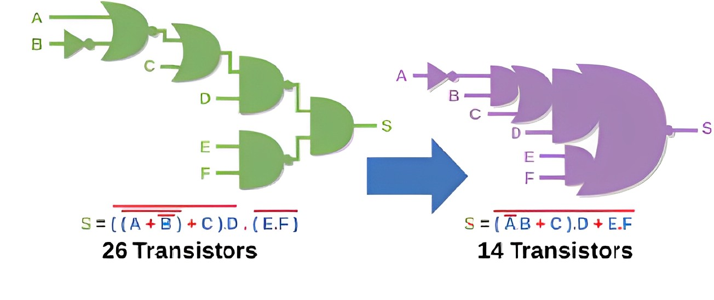

# Methodology for Approximate Comparator Design

This document outlines the core approximation strategies used in designing gate-level digital comparators for bit-widths of 4, 8, 16, and 32 bits. The methodology focuses on reducing logic complexity—specifically gate and wire count—while preserving the functional accuracy of the comparator to remain above 85%.

Each technique was applied selectively based on the complexity and size of the comparator. This allowed us to balance trade-offs between accuracy and hardware cost.

---

## Overview of Applied Techniques

| Bit Width | Techniques Used                                                        |
|-----------|-------------------------------------------------------------------------|
| 4-bit     | Majority Voting                                                        |
| 8-bit     | Majority Voting                                                        |
| 16-bit    | Majority Voting, Gate Substitution, Gate Merging, Combined Techniques  |
| 32-bit    | Majority Voting, Gate Substitution, Gate Merging, Combined Techniques  |

---

## 1. Majority Voting

**Majority Voting** is an approximation technique where only the most significant bits (MSBs) of the input operands are compared to determine the comparator output. The lower significant bits (LSBs) are ignored under the assumption that MSBs contribute more to determining relational magnitude (greater than, equal to, less than).

### Key Characteristics:
- Simplifies logic by reducing the number of active comparison bits.
- Useful for small-width comparators (4-bit and 8-bit) where decision fidelity can be preserved.
- Reduces gate usage without dramatically compromising accuracy.

---

## 2. Gate Substitution

**Gate Substitution** involves replacing complex logic gates or compound logic expressions with simpler, lower-cost approximations. This results in logic that mimics expected behavior in most scenarios but deviates in edge cases.

### Key Characteristics:
- Trades off exact logical accuracy for reduced complexity.
- Often used when a logic path involves multi-level expressions.
- Contributes to reductions in propagation delay and area.

---

## 3. Gate Merging

**Gate Merging** is the process of identifying common sub-expressions or duplicated logic and collapsing them into a shared logic path or gate. It is a structural optimization applied to eliminate redundancy in the circuit.

### Key Characteristics:
- Reduces the total number of gates and interconnects.
- Especially effective in large comparators with repeated decision structures.
- Maintains accuracy while improving gate utilization efficiency.

---

## 4. Combined Gate Substitution and Merging

For high-bit-width comparators (16-bit and 32-bit), we applied a combination of **Gate Substitution** and **Gate Merging**. This hybrid approach leverages the advantages of both techniques:

- Substitution reduces local complexity in logic expressions.
- Merging improves global efficiency by collapsing duplicated logic.

This combined method provided the highest gate and wire savings with acceptable accuracy degradation, making it particularly effective in area-critical designs.

---

## Summary

The applied approximation techniques were chosen based on:
- Bit-width complexity
- Target accuracy threshold (>85%)
- Hardware cost constraints

By selectively applying these strategies, we achieved:
- Over 47% gate reduction in 32-bit comparators
- Accuracy consistently maintained above 85%

These methods establish a scalable and repeatable methodology for designing approximate comparators in power- and area-constrained digital systems.

